# 04 — UI Flows: Use Cases, Sequences, Flowcharts

**Status:** describes Studio as built through Phase 7.1 (local, single user). `02-use-cases.md` is the planning view: personas, goals and UX rules. This document is the as-built view: what a user does on each screen, which API calls it makes, which files change, and how the agent picks them up.

Diagrams are Mermaid and render on GitHub.

## 1. Actors and system parts

| Actor / part | Role |
|---|---|
| **User** | Uses Studio in the browser at `http://127.0.0.1:4750/studio`. |
| **Studio UI** | React app in `studio/` (routes `/`, `/new`, `/library`, `/p/:projectId`, `/setup`, `/settings`). |
| **Backlot** | FastAPI server (`backlot/`). Serves the UI, the write API `/api/v1/*`, the read-only board API `/api/*` and SSE streams. |
| **Disk** | `projects/<id>/` (checkpoints, artifacts, `studio/`, `inputs/`), `music_library/`, `config.yaml`, `.env`. |
| **Agent** | The coding agent CLI (Claude Code, Codex, Cursor, …) that does the production. Talks to Studio only through files and two CLI commands: `python -m backlot await-decision` and `consume-decision`. |
| **Capability probe** | Background job that runs `provider_menu_summary()` and runtime checks (`backlot/setup_probe.py`). |
| **Demo renderer** | Background job that runs `render_demo.py` for one demo. |

Rules that hold in every flow:
- Studio writes **intents** only: `studio/intake.json`, `studio/inputs.json`, `inputs/*`, `studio/decisions/*.json`, allowlisted `config.yaml` keys, `.env` keys, `music_library/*`. It never writes checkpoints or agent artifacts.
- Every non-GET `/api/v1` call carries `X-Studio-Token` (from `GET /api/v1/session`) and a same-site `Origin`. Otherwise it gets 403.
- Every project route goes through `project_access` (view or edit). An unknown, hidden (`_…`, `.…`) or forbidden project id answers 404.
- Errors come back as `{detail, code}`. The UI shows the translated text for `code` (en/vi).

## 2. Use case overview

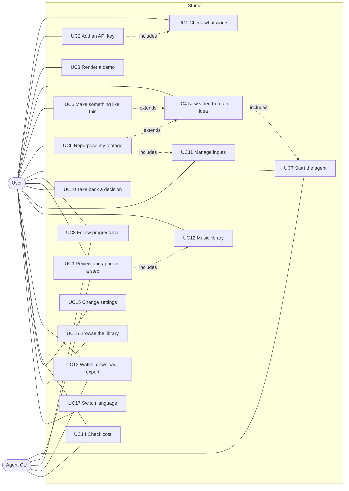
```mermaid
flowchart LR
  user([User])
  agent([Agent CLI])

  subgraph Studio
    UC1[UC1 Check what works]
    UC2[UC2 Add an API key]
    UC3[UC3 Render a demo]
    UC4[UC4 New video from an idea]
    UC5[UC5 Make something like this]
    UC6[UC6 Repurpose my footage]
    UC7[UC7 Start the agent]
    UC8[UC8 Follow progress live]
    UC9[UC9 Review and approve a step]
    UC10[UC10 Take back a decision]
    UC11[UC11 Manage inputs]
    UC12[UC12 Music library]
    UC13[UC13 Watch, download, export]
    UC14[UC14 Check cost]
    UC15[UC15 Change settings]
    UC16[UC16 Browse the library]
    UC17[UC17 Switch language]
  end

  user --- UC1 & UC2 & UC3 & UC4 & UC5 & UC6 & UC7
  user --- UC8 & UC9 & UC10 & UC11 & UC12 & UC13 & UC14 & UC15 & UC16 & UC17
  UC4 -. includes .-> UC7
  UC5 -. extends .-> UC4
  UC6 -. extends .-> UC4
  UC6 -. includes .-> UC11
  UC9 -. includes .-> UC12
  UC2 -. includes .-> UC1
  agent --- UC7
  agent --- UC9
  agent --- UC8
  agent --- UC13
  agent --- UC14
```

| Id | Use case | Screen | Main API | Phase |
|---|---|---|---|---|
| UC1 | Check what works on this machine | Setup | `GET /setup`, `POST /setup/recheck`, `GET /jobs/{id}` | 2 |
| UC2 | Add an API key | Setup (unlock card) | `PUT /setup/env` | 2 |
| UC3 | Render a demo with zero keys | Home | `GET /demos`, `POST /demos/{name}/render`, `GET /jobs/{id}` | 3 |
| UC4 | New video from an idea | New video | `GET /pipelines`, `GET /styles`, `POST /projects` | 3 |
| UC5 | Make something like this (reference) | New video, Project | `POST /projects` (with `reference`), `POST /projects/{id}/references` | 3, 5 |
| UC6 | Repurpose my footage | New video (footage step) | `POST /projects`, `POST /projects/{id}/uploads` | 5 |
| UC7 | Start the agent | Project (kickoff panel) | `GET /projects/{id}/kickoff` | 3 |
| UC8 | Follow progress live | Home, Library, Project | `GET /api/projects`, `GET /api/project/{id}/state`, SSE | 1 |
| UC9 | Review and approve a step | Project (review panel) | `GET/POST /projects/{id}/decisions` | 4 |
| UC10 | Take back a decision | Project (review panel) | `DELETE /projects/{id}/decisions/{did}` | 4 |
| UC11 | Manage inputs (files, links) | Project (inputs panel) | `GET /projects/{id}/inputs`, uploads and references routes | 5 |
| UC12 | Music library | Wizard look step, proposal review | `GET/POST /music`, `GET /music/tracks/{name}` | 5 |
| UC13 | Watch, download, export | Project (result panel) | `GET /projects/{id}/results`, `GET /projects/{id}/export`, `/media/...` | 6 |
| UC14 | Check cost | Project (cost panel), Library | `GET /projects/{id}/cost`, `GET /cost/summary` | 6 |
| UC15 | Change settings | Settings | `GET/PUT /settings` | 6 |
| UC16 | Browse the library | Library | `GET /api/projects`, library SSE | 1 |
| UC17 | Switch language | Every page (header) | none (browser `localStorage`) | 3 |

All `/api/v1` paths below are written without the prefix, e.g. `GET /setup` means `GET /api/v1/setup`.

## 3. Use case details

Each use case lists its actor, preconditions, main flow, alternative and error flows, and the result.

### UC1 — Check what works on this machine
- **Actor:** User. **Precondition:** Backlot is running.
- **Main flow:**
  1. The user opens **Setup** (or the first-run prompt on Home).
  2. The UI calls `GET /setup`. If no probe result is cached, Backlot starts the probe job and answers `202 {status: "checking", job}`.
  3. The UI polls `GET /jobs/{id}` until the job ends, then calls `GET /setup` again.
  4. The page shows the setup tier badge, the video types that work now, locked types with the reason, unlock cards (one key each), runtimes and warnings.
- **Alternatives:**
  - *Re-check:* the user presses **Check again**. `POST /setup/recheck` returns a job; the old view stays visible with a "rechecking" note until it ends.
  - *Probe failure:* the job ends `failed`; the UI shows the error and a retry button.
- **Result:** the user knows what they can make now and which single key unlocks more.

### UC2 — Add an API key
- **Actor:** User. **Precondition:** a probe result exists (UC1).
- **Main flow:**
  1. On an unlock card, the user pastes a key value and presses **Save**.
  2. `PUT /setup/env {key, value}`. Backlot checks that the key is one some tool uses, writes it to `.env` (mode `0600`) and returns `{key, set, hint}` (last 4 characters only).
  3. The UI starts a re-check (UC1) so locks update.
- **Errors:** `403` when `STUDIO_READONLY_ENV=1`; `409` when no probe has run yet; `422` for an unknown key or a bad value.
- **Result:** the key is stored; it is never shown again in full and never logged.

### UC3 — Render a demo with zero keys
- **Actor:** User. **Precondition:** none (the demos need no keys).
- **Main flow:**
  1. Home shows demo cards from `GET /demos`.
  2. The user presses **Render** on a card. `POST /demos/{name}/render` returns `202` with a job.
  3. The card shows progress by polling `GET /jobs/{id}`.
  4. When the job is done, the card plays the video.
- **Alternatives:** a render already running for that demo is reused (the card shows its job); a failed job shows its error and a retry.
- **Errors:** `404` for an unknown demo name.

### UC4 — New video from an idea
- **Actor:** User. **Precondition:** at least one video type is unlocked.
- **Main flow:**
  1. The user opens **New video**. The wizard loads goals (from `studio/src/content/goals.ts`), `GET /pipelines` and `GET /styles`.
  2. **Goal:** the user picks a goal card. Locked goals show why and link to Setup.
  3. **Brief:** topic, audience, platform/aspect, duration, tone.
  4. **Look:** style, budget cap, optional music (UC12).
  5. **Review:** a summary; the user presses **Create**.
  6. `POST /projects`. Backlot validates the choices, refuses locked types, makes a project id from the title, creates the project (`project.json` via `init_project`) and writes `studio/intake.json`.
  7. The UI goes to `/p/<id>` and shows the kickoff panel (UC7).
- **Alternatives:**
  - *Back:* every step can go back without losing input.
  - *Invalid step:* the **Next** button stays disabled and the invalid field says why.
- **Errors:** `409` when the type became locked meanwhile ("needs more setup — see Setup"); `422` for invalid choices.
- **Result:** the project exists with a complete brief the agent will not re-ask.

### UC5 — Make something like this
- **Actor:** User. Extends UC4.
- **Main flow:** in the wizard, the user pastes a reference link and a note (what to keep or change). `POST /projects` stores it in `studio/inputs.json` as a reference. Files can be added later on the project page (UC11).
- **Agent side:** at kickoff the agent runs the reference-analysis flow and writes `artifacts/video_analysis_brief.json`. The review panel shows it as "What the agent learned".
- **Rules:** http(s) links only; Backlot never fetches the URL; at most a fixed number of references (`too_many_references`); the same URL twice is refused (`duplicate_reference`).

### UC6 — Repurpose my footage
- **Actor:** User. Extends UC4 for footage goals.
- **Main flow:**
  1. After the goal, the wizard inserts **Add your footage**. The user drops files; the UI reads `GET /uploads/limits` and checks size and type before sending.
  2. Files are queued in the tab. After **Create**, the UI uploads each one with `POST /projects/{id}/uploads` and shows progress.
  3. Backlot streams each file to a hidden partial name, checks the size cap and type, then renames it into `inputs/` and lists it in `studio/inputs.json`.
- **Errors:** `413 too_large`, `415 unsupported_type`, `400 empty_file` / `bad_name`. The row shows the error and a retry or remove button.
- **Known gap:** files still queued are lost if the tab closes mid-upload.

### UC7 — Start the agent
- **Actor:** User, then Agent.
- **Main flow:**
  1. The project page shows the kickoff panel while the project has no checkpoint yet. It loads `GET /projects/{id}/kickoff`: one command per supported CLI, e.g. `Continue Studio project <id>`.
  2. The user copies the command and pastes it into their agent chat.
  3. The agent reads `studio/intake.json` and `studio/inputs.json` (AGENT_GUIDE "Projects Created in Studio") and starts the pipeline.
  4. The first checkpoint appears; the panel hides and the step timeline takes over (UC8).
- **Note:** the kickoff text stays in English in every UI language, because the agent instructions match on it.

### UC8 — Follow progress live
- **Actor:** User; the Agent produces the data.
- **Main flow:**
  1. Home and Library load `GET /api/projects` and subscribe to `GET /api/library/events` (SSE).
  2. The project page loads `GET /api/project/{id}/state` and subscribes to `GET /api/project/{id}/events`.
  3. When the agent writes a checkpoint, artifact or `events.jsonl` line, Backlot's change hub pushes an event; the UI refetches the affected queries.
  4. The page shows the step timeline (done, working, waiting for you, failed), the activity feed, brief, script, storyboard, decisions and inputs.
- **Alternatives:** if the server stops, the UI shows "server down"; `EventSource` reconnects by itself.

### UC9 — Review and approve a step
- **Actor:** User, then Agent.
- **Precondition:** a stage checkpoint has `status: "awaiting_human"`. Home and the project card show **Waiting for you**.
- **Main flow:**
  1. The user opens the project. The review panel shows the step's content (script, storyboard, proposal concepts, assets), the agent's self-review and the cost so far.
  2. The user picks **Approve**, **Request changes** (notes required) or **Stop project**.
  3. At the proposal step, an approval can also carry picks: concept, budget, look, rendering engine, music.
  4. `POST /projects/{id}/decisions {stage, checkpoint_timestamp, action, notes, proposal}`. Backlot validates it and writes `studio/decisions/<did>.json`. The panel shows "Sent — the agent will pick this up".
  5. The agent, waiting at the gate with `python -m backlot await-decision <id> <stage>`, receives the decision, applies it and runs `consume-decision`, which renames the file to `<did>.consumed.json`.
  6. The new checkpoint arrives over SSE; the step turns green, or the agent revises and asks again.
- **Errors:** `409 not_awaiting`, `409 stale_checkpoint` (the step changed; the panel reloads the new version), `409 already_decided`, `422 notes_required`, `422 unknown_concept`, `422 runtime_unavailable`.
- **Result:** no review point needs a typed chat reply.

### UC10 — Take back a decision
- **Actor:** User. **Precondition:** the decision is still pending (not consumed).
- **Main flow:** the user presses **Take back**. `DELETE /projects/{id}/decisions/{did}` removes the pending file (`204`). The review panel opens again.
- **Errors:** `409 already_consumed` when the agent applied it first; `404 unknown_decision` when it no longer exists.

### UC11 — Manage inputs
- **Actor:** User. **Screen:** project page, inputs panel.
- **Main flow:** `GET /projects/{id}/inputs` lists files and links, with `started` (a checkpoint exists). The user can upload more files (UC6 rules), add a reference link (UC5 rules), remove a file or remove a link.
- **Rule:** after the agent has started, removing is refused with `409 already_started`; adding is still allowed.

### UC12 — Music library
- **Actor:** User. **Screens:** wizard look step, proposal review.
- **Main flow:** the picker lists `GET /music`, previews a track with `GET /music/tracks/{name}`, and uploads a new track with `POST /music` (audio types, size cap). The chosen track name goes into the intake or the proposal picks.
- **Errors:** `413`, `415`, `404 unknown_track` (the track saved but could not be listed back).

### UC13 — Watch, download, export
- **Actor:** User. **Precondition:** the agent has rendered.
- **Main flow:**
  1. The result panel loads `GET /projects/{id}/results`: final video, other renders, and the render report summary.
  2. The video plays from `/media/<id>/<path>`; **Download** saves the MP4.
  3. **Export bundle** calls `GET /projects/{id}/export`. A single exported file is returned as is; an export folder is zipped on the fly.
- **Errors:** `404` when the agent has not exported, or when `publish_log` names a path outside the project or the project folder itself.

### UC14 — Check cost
- **Main flow:** the cost panel loads `GET /projects/{id}/cost`: spent, reserved, remaining against the cap (intake cap, else the settings budget), per-step spend and the budget mode. Library shows spend this month with `GET /cost/summary?since=<start of month, ISO time>`.
- **Errors:** `422` when `since` is not an ISO date-time with a time zone.

### UC15 — Change settings
- **Main flow:** **Settings** loads `GET /settings` (allowlisted `config.yaml` keys: budget, checkpoint policy, output defaults). The user edits and saves with `PUT /settings`; field errors show inline (`422`). The agent reads the new values at the start of its next production.
- **Errors:** `403` when `STUDIO_READONLY_CONFIG=1`.

### UC16 — Browse the library
- **Main flow:** Library lists projects from `GET /api/projects` with search, series grouping and a status filter (all, waiting for you, in progress, needs attention, done) and the spend this month (UC14). A card opens `/p/<id>`. The list updates live (UC8).

### UC17 — Switch language
- **Main flow:** the header language menu switches between English and Tiếng Việt. The choice is saved in `localStorage`; the first visit follows the browser language. All Studio text and API error codes are translated; the classic board is not.

## 4. Sequence diagrams

### 4.1 Opening Studio (session and token)

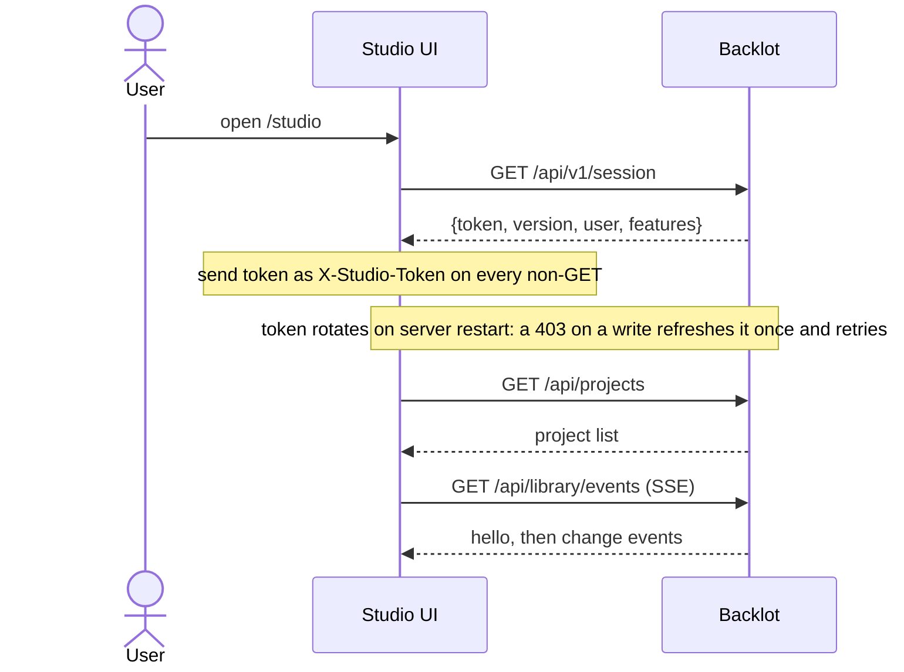
```mermaid
sequenceDiagram
  actor U as User
  participant UI as Studio UI
  participant B as Backlot
  U->>UI: open /studio
  UI->>B: GET /api/v1/session
  B-->>UI: {token, version, user, features}
  Note over UI: send token as X-Studio-Token on every non-GET
  Note over UI,B: token rotates on server restart: a 403 on a write refreshes it once and retries
  UI->>B: GET /api/projects
  B-->>UI: project list
  UI->>B: GET /api/library/events (SSE)
  B-->>UI: hello, then change events
```

### 4.2 Setup check and adding a key (UC1, UC2)

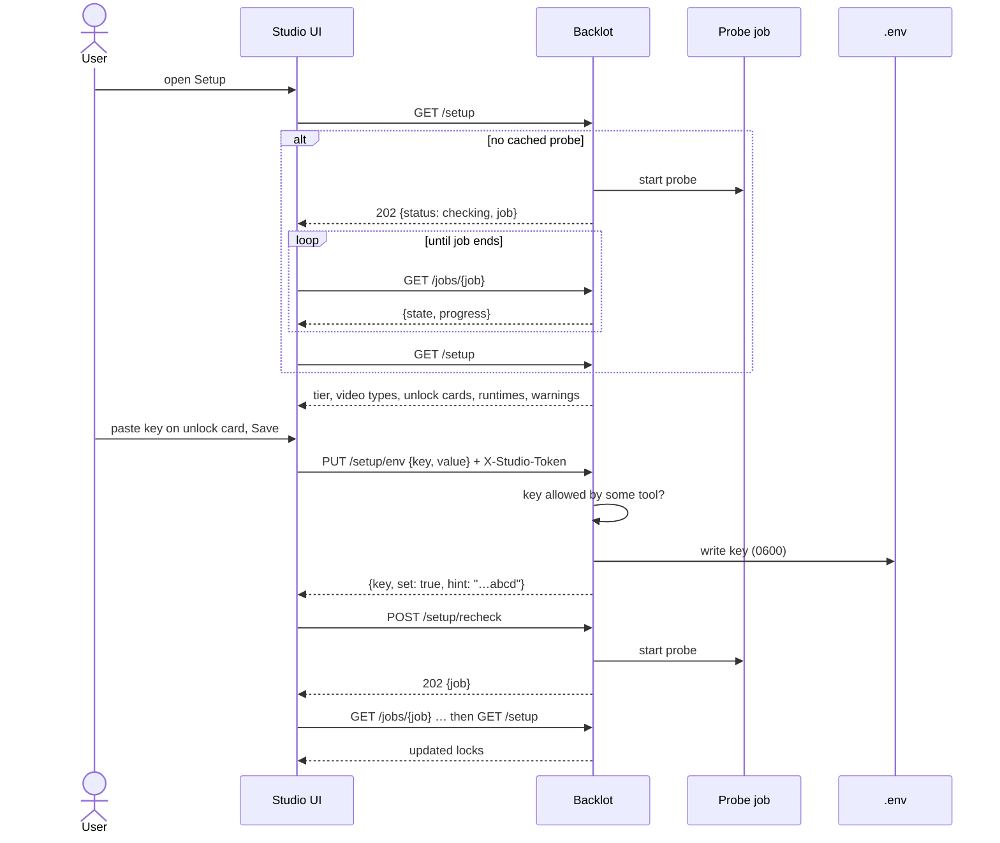
```mermaid
sequenceDiagram
  actor U as User
  participant UI as Studio UI
  participant B as Backlot
  participant P as Probe job
  participant E as .env
  U->>UI: open Setup
  UI->>B: GET /setup
  alt no cached probe
    B->>P: start probe
    B-->>UI: 202 {status: checking, job}
    loop until job ends
      UI->>B: GET /jobs/{job}
      B-->>UI: {state, progress}
    end
    UI->>B: GET /setup
  end
  B-->>UI: tier, video types, unlock cards, runtimes, warnings
  U->>UI: paste key on unlock card, Save
  UI->>B: PUT /setup/env {key, value} + X-Studio-Token
  B->>B: key allowed by some tool?
  B->>E: write key (0600)
  B-->>UI: {key, set: true, hint: "…abcd"}
  UI->>B: POST /setup/recheck
  B->>P: start probe
  B-->>UI: 202 {job}
  UI->>B: GET /jobs/{job} … then GET /setup
  B-->>UI: updated locks
```

### 4.3 Rendering a demo (UC3)

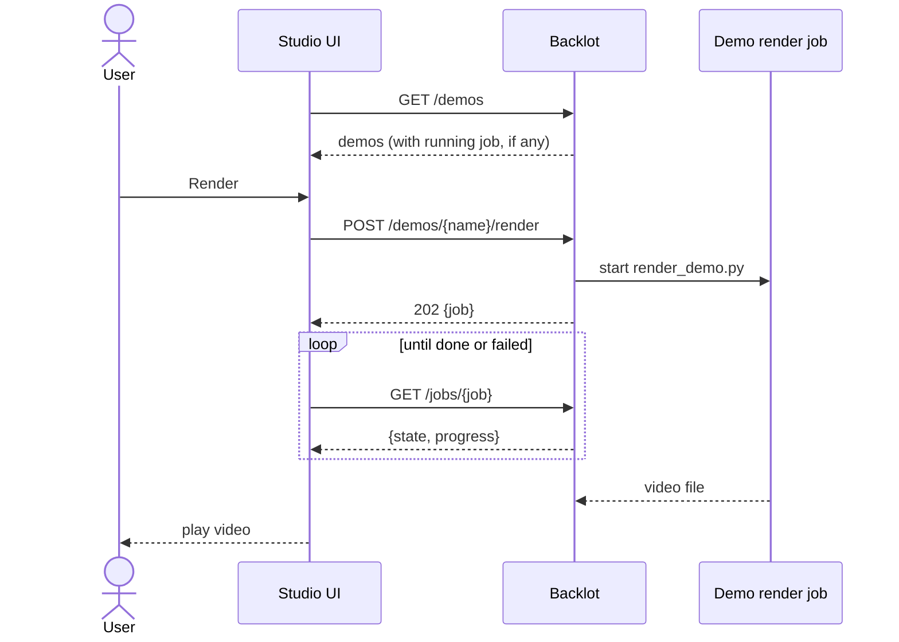
```mermaid
sequenceDiagram
  actor U as User
  participant UI as Studio UI
  participant B as Backlot
  participant R as Demo render job
  UI->>B: GET /demos
  B-->>UI: demos (with running job, if any)
  U->>UI: Render
  UI->>B: POST /demos/{name}/render
  B->>R: start render_demo.py
  B-->>UI: 202 {job}
  loop until done or failed
    UI->>B: GET /jobs/{job}
    B-->>UI: {state, progress}
  end
  R-->>B: video file
  UI-->>U: play video
```

### 4.4 Creating a project and starting the agent (UC4–UC7)

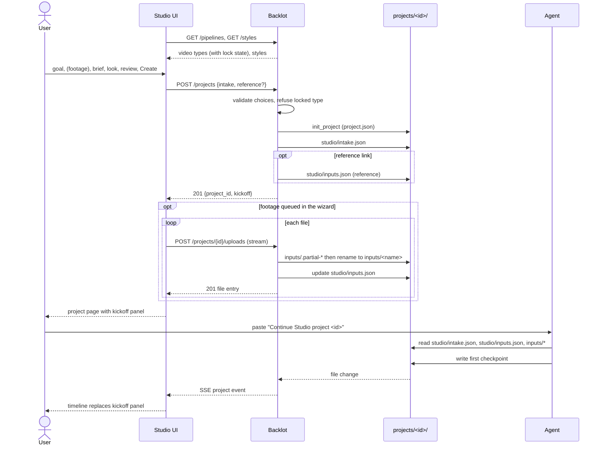
```mermaid
sequenceDiagram
  actor U as User
  participant UI as Studio UI
  participant B as Backlot
  participant D as projects/<id>/
  participant A as Agent
  UI->>B: GET /pipelines, GET /styles
  B-->>UI: video types (with lock state), styles
  U->>UI: goal, (footage), brief, look, review, Create
  UI->>B: POST /projects {intake, reference?}
  B->>B: validate choices, refuse locked type
  B->>D: init_project (project.json)
  B->>D: studio/intake.json
  opt reference link
    B->>D: studio/inputs.json (reference)
  end
  B-->>UI: 201 {project_id, kickoff}
  opt footage queued in the wizard
    loop each file
      UI->>B: POST /projects/{id}/uploads (stream)
      B->>D: inputs/.partial-* then rename to inputs/<name>
      B->>D: update studio/inputs.json
      B-->>UI: 201 file entry
    end
  end
  UI-->>U: project page with kickoff panel
  U->>A: paste "Continue Studio project <id>"
  A->>D: read studio/intake.json, studio/inputs.json, inputs/*
  A->>D: write first checkpoint
  D-->>B: file change
  B-->>UI: SSE project event
  UI-->>U: timeline replaces kickoff panel
```

### 4.5 Review and approve (UC9) — full gate round trip

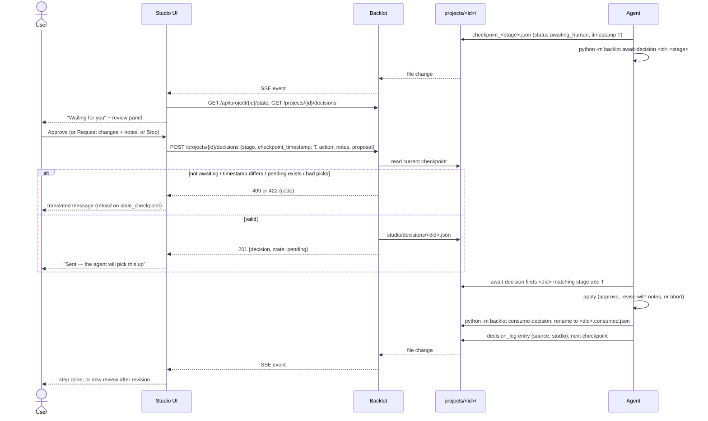
```mermaid
sequenceDiagram
  actor U as User
  participant UI as Studio UI
  participant B as Backlot
  participant D as projects/<id>/
  participant A as Agent
  A->>D: checkpoint_<stage>.json (status awaiting_human, timestamp T)
  A->>A: python -m backlot await-decision <id> <stage>
  D-->>B: file change
  B-->>UI: SSE event
  UI->>B: GET /api/project/{id}/state, GET /projects/{id}/decisions
  UI-->>U: "Waiting for you" + review panel
  U->>UI: Approve (or Request changes + notes, or Stop)
  UI->>B: POST /projects/{id}/decisions {stage, checkpoint_timestamp: T, action, notes, proposal}
  B->>D: read current checkpoint
  alt not awaiting / timestamp differs / pending exists / bad picks
    B-->>UI: 409 or 422 {code}
    UI-->>U: translated message (reload on stale_checkpoint)
  else valid
    B->>D: studio/decisions/<did>.json
    B-->>UI: 201 {decision, state: pending}
    UI-->>U: "Sent — the agent will pick this up"
  end
  A->>D: await-decision finds <did> matching stage and T
  A->>A: apply (approve, revise with notes, or abort)
  A->>D: python -m backlot consume-decision: rename to <did>.consumed.json
  A->>D: decision_log entry (source: studio), next checkpoint
  D-->>B: file change
  B-->>UI: SSE event
  UI-->>U: step done, or new review after revision
```

### 4.6 Taking back a decision (UC10)

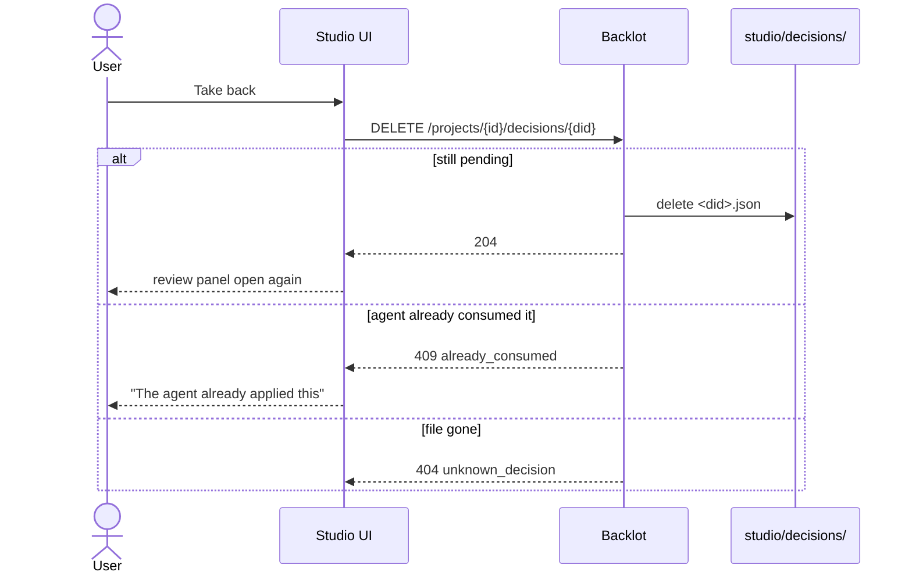
```mermaid
sequenceDiagram
  actor U as User
  participant UI as Studio UI
  participant B as Backlot
  participant D as studio/decisions/
  U->>UI: Take back
  UI->>B: DELETE /projects/{id}/decisions/{did}
  alt still pending
    B->>D: delete <did>.json
    B-->>UI: 204
    UI-->>U: review panel open again
  else agent already consumed it
    B-->>UI: 409 already_consumed
    UI-->>U: "The agent already applied this"
  else file gone
    B-->>UI: 404 unknown_decision
  end
```

### 4.7 Uploading a file (UC6, UC11)

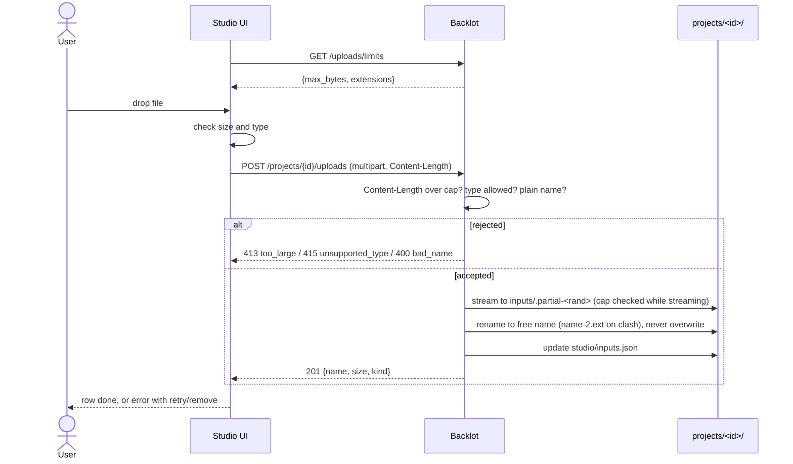
```mermaid
sequenceDiagram
  actor U as User
  participant UI as Studio UI
  participant B as Backlot
  participant D as projects/<id>/
  UI->>B: GET /uploads/limits
  B-->>UI: {max_bytes, extensions}
  U->>UI: drop file
  UI->>UI: check size and type
  UI->>B: POST /projects/{id}/uploads (multipart, Content-Length)
  B->>B: Content-Length over cap? type allowed? plain name?
  alt rejected
    B-->>UI: 413 too_large / 415 unsupported_type / 400 bad_name
  else accepted
    B->>D: stream to inputs/.partial-<rand> (cap checked while streaming)
    B->>D: rename to free name (name-2.ext on clash), never overwrite
    B->>D: update studio/inputs.json
    B-->>UI: 201 {name, size, kind}
  end
  UI-->>U: row done, or error with retry/remove
```

### 4.8 Results and export (UC13)

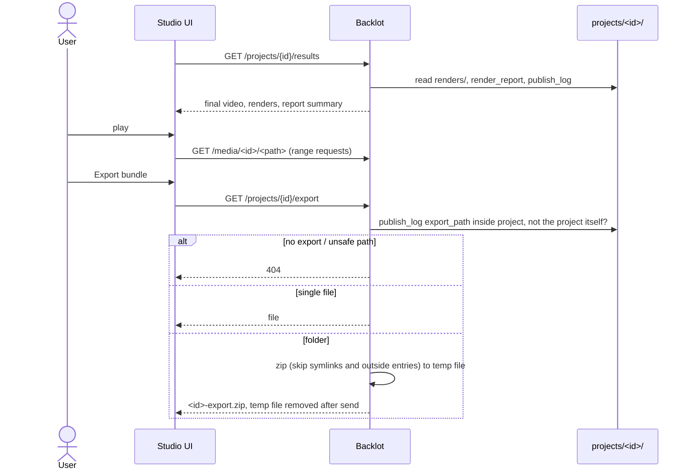
```mermaid
sequenceDiagram
  actor U as User
  participant UI as Studio UI
  participant B as Backlot
  participant D as projects/<id>/
  UI->>B: GET /projects/{id}/results
  B->>D: read renders/, render_report, publish_log
  B-->>UI: final video, renders, report summary
  U->>UI: play
  UI->>B: GET /media/<id>/<path> (range requests)
  U->>UI: Export bundle
  UI->>B: GET /projects/{id}/export
  B->>D: publish_log export_path inside project, not the project itself?
  alt no export / unsafe path
    B-->>UI: 404
  else single file
    B-->>UI: file
  else folder
    B->>B: zip (skip symlinks and outside entries) to temp file
    B-->>UI: <id>-export.zip, temp file removed after send
  end
```

### 4.9 Settings (UC15)

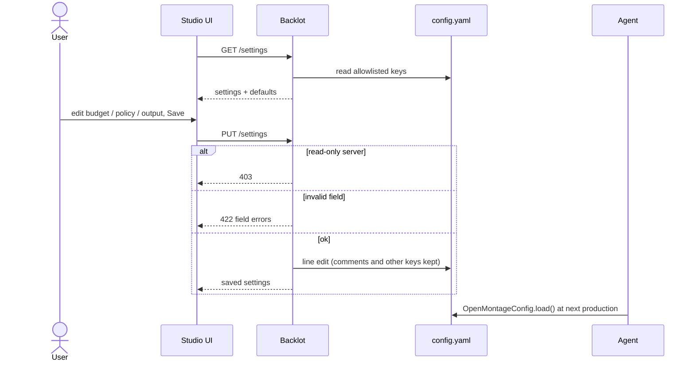
```mermaid
sequenceDiagram
  actor U as User
  participant UI as Studio UI
  participant B as Backlot
  participant C as config.yaml
  participant A as Agent
  UI->>B: GET /settings
  B->>C: read allowlisted keys
  B-->>UI: settings + defaults
  U->>UI: edit budget / policy / output, Save
  UI->>B: PUT /settings
  alt read-only server
    B-->>UI: 403
  else invalid field
    B-->>UI: 422 field errors
  else ok
    B->>C: line edit (comments and other keys kept)
    B-->>UI: saved settings
  end
  A->>C: OpenMontageConfig.load() at next production
```

## 5. Flowcharts

### 5.1 Navigation and "one next action"

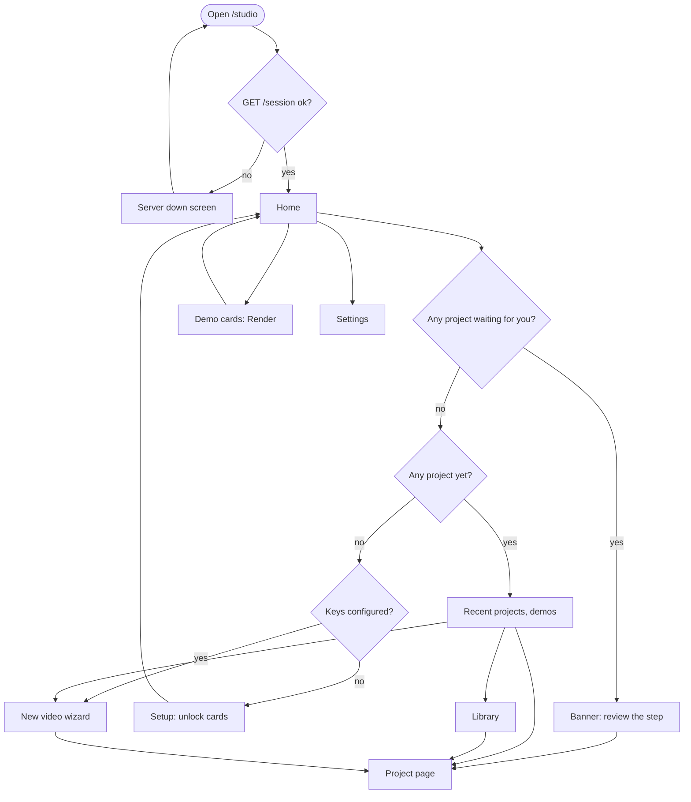
```mermaid
flowchart TD
  start([Open /studio]) --> session{GET /session ok?}
  session -- no --> down[Server down screen] --> start
  session -- yes --> home[Home]
  home --> waiting{Any project waiting for you?}
  waiting -- yes --> banner[Banner: review the step] --> project
  waiting -- no --> firstrun{Any project yet?}
  firstrun -- no --> choose{Keys configured?}
  choose -- no --> setup[Setup: unlock cards] --> home
  choose -- yes --> newvideo[New video wizard]
  firstrun -- yes --> recent[Recent projects, demos]
  recent --> project[Project page]
  recent --> newvideo
  recent --> library[Library] --> project
  home --> demos[Demo cards: Render] --> home
  newvideo --> project
  home --> settings[Settings]
```

### 5.2 New video wizard

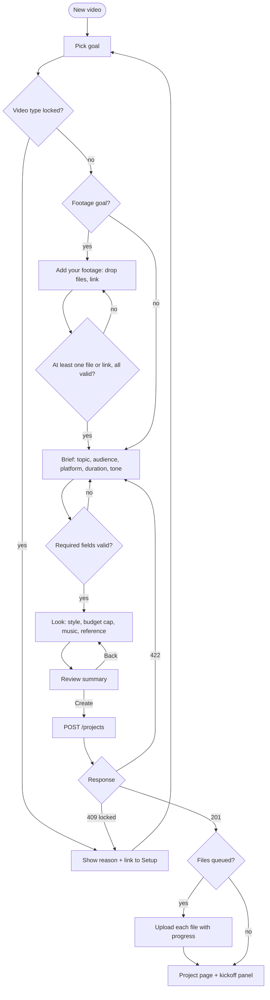
```mermaid
flowchart TD
  a([New video]) --> goal[Pick goal]
  goal --> locked{Video type locked?}
  locked -- yes --> why[Show reason + link to Setup] --> goal
  locked -- no --> footage{Footage goal?}
  footage -- yes --> files[Add your footage: drop files, link]
  files --> fok{At least one file or link, all valid?}
  fok -- no --> files
  fok -- yes --> brief
  footage -- no --> brief[Brief: topic, audience, platform, duration, tone]
  brief --> bok{Required fields valid?}
  bok -- no --> brief
  bok -- yes --> look[Look: style, budget cap, music, reference]
  look --> review[Review summary]
  review -- Back --> look
  review -- Create --> post[POST /projects]
  post --> res{Response}
  res -- 409 locked --> why
  res -- 422 --> brief
  res -- 201 --> up{Files queued?}
  up -- yes --> upload[Upload each file with progress] --> page
  up -- no --> page[Project page + kickoff panel]
```

### 5.3 Project page: what the user sees

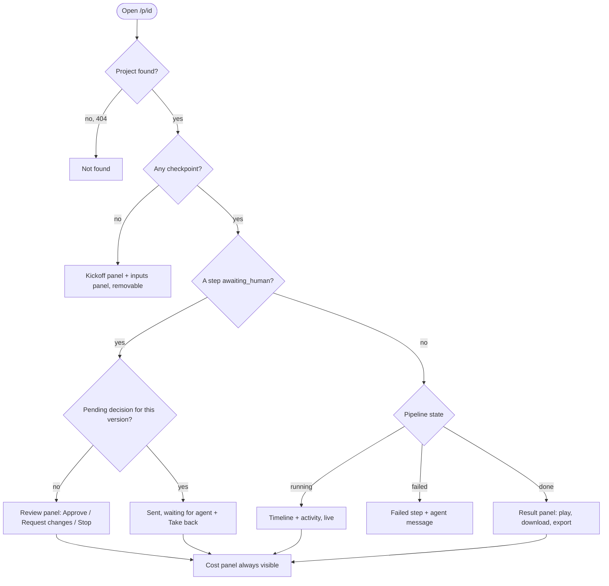
```mermaid
flowchart TD
  p([Open /p/id]) --> exists{Project found?}
  exists -- no, 404 --> nf[Not found]
  exists -- yes --> cp{Any checkpoint?}
  cp -- no --> kick[Kickoff panel + inputs panel, removable]
  cp -- yes --> await{A step awaiting_human?}
  await -- yes --> pending{Pending decision for this version?}
  pending -- no --> review[Review panel: Approve / Request changes / Stop]
  pending -- yes --> sent[Sent, waiting for agent + Take back]
  await -- no --> state{Pipeline state}
  state -- running --> live[Timeline + activity, live]
  state -- failed --> failed[Failed step + agent message]
  state -- done --> result[Result panel: play, download, export]
  live & review & sent & result --> cost[Cost panel always visible]
```

### 5.4 Decision validation (server)

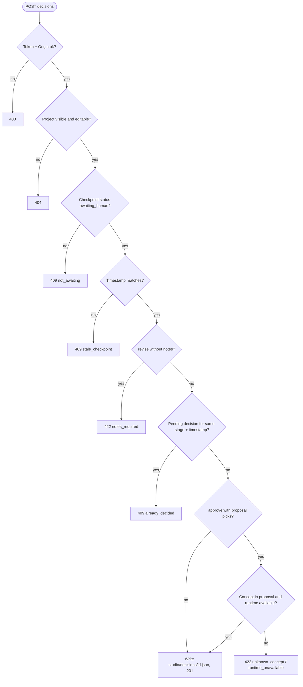
```mermaid
flowchart TD
  r([POST decisions]) --> tok{Token + Origin ok?}
  tok -- no --> e403[403]
  tok -- yes --> acc{Project visible and editable?}
  acc -- no --> e404[404]
  acc -- yes --> aw{Checkpoint status awaiting_human?}
  aw -- no --> na[409 not_awaiting]
  aw -- yes --> ts{Timestamp matches?}
  ts -- no --> st[409 stale_checkpoint]
  ts -- yes --> nt{revise without notes?}
  nt -- yes --> nr[422 notes_required]
  nt -- no --> dup{Pending decision for same stage + timestamp?}
  dup -- yes --> ad[409 already_decided]
  dup -- no --> pk{approve with proposal picks?}
  pk -- no --> ok
  pk -- yes --> con{Concept in proposal and runtime available?}
  con -- no --> bad[422 unknown_concept / runtime_unavailable]
  con -- yes --> ok[Write studio/decisions/id.json, 201]
```

### 5.5 Upload validation (server)

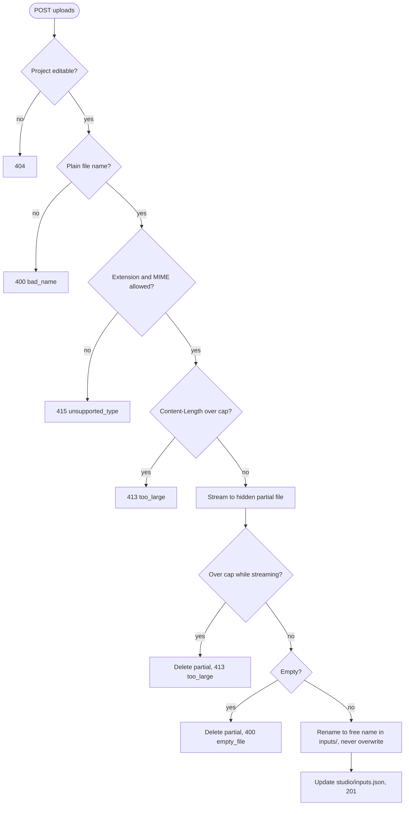
```mermaid
flowchart TD
  u([POST uploads]) --> acc{Project editable?}
  acc -- no --> e404[404]
  acc -- yes --> name{Plain file name?}
  name -- no --> bn[400 bad_name]
  name -- yes --> type{Extension and MIME allowed?}
  type -- no --> ut[415 unsupported_type]
  type -- yes --> len{Content-Length over cap?}
  len -- yes --> tl[413 too_large]
  len -- no --> stream[Stream to hidden partial file]
  stream --> cap{Over cap while streaming?}
  cap -- yes --> drop[Delete partial, 413 too_large]
  cap -- no --> empty{Empty?}
  empty -- yes --> ef[Delete partial, 400 empty_file]
  empty -- no --> mv[Rename to free name in inputs/, never overwrite]
  mv --> idx[Update studio/inputs.json, 201]
```

## 6. State diagrams

### 6.1 Studio decision

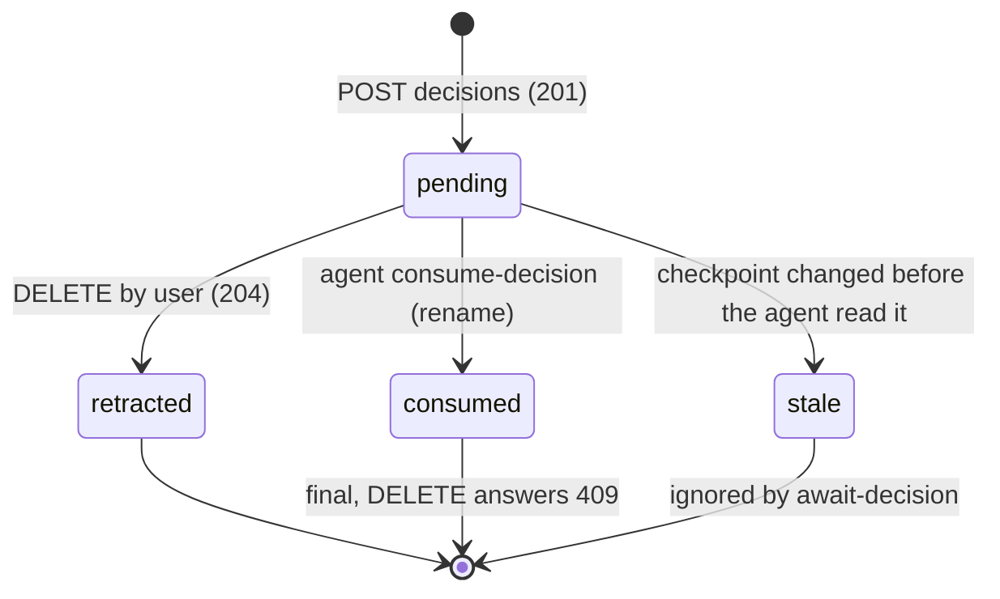
```mermaid
stateDiagram-v2
  [*] --> pending: POST decisions (201)
  pending --> retracted: DELETE by user (204)
  pending --> consumed: agent consume-decision (rename)
  pending --> stale: checkpoint changed before the agent read it
  retracted --> [*]
  consumed --> [*]: final, DELETE answers 409
  stale --> [*]: ignored by await-decision
```

### 6.2 Step as shown on the timeline

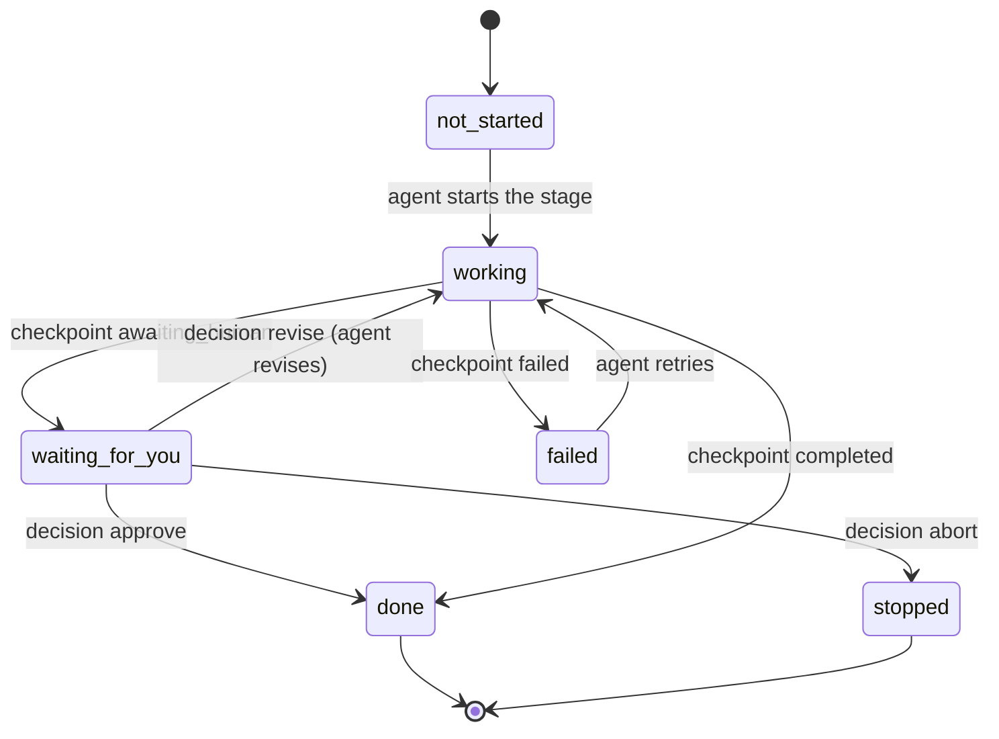
```mermaid
stateDiagram-v2
  [*] --> not_started
  not_started --> working: agent starts the stage
  working --> waiting_for_you: checkpoint awaiting_human
  waiting_for_you --> working: decision revise (agent revises)
  waiting_for_you --> done: decision approve
  waiting_for_you --> stopped: decision abort
  working --> done: checkpoint completed
  working --> failed: checkpoint failed
  failed --> working: agent retries
  done --> [*]
  stopped --> [*]
```

### 6.3 Project inputs

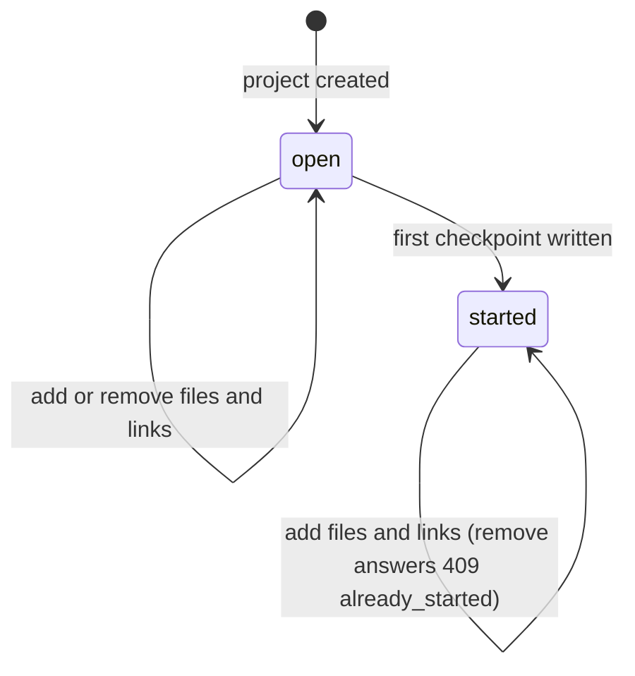
```mermaid
stateDiagram-v2
  [*] --> open: project created
  open --> open: add or remove files and links
  open --> started: first checkpoint written
  started --> started: add files and links (remove answers 409 already_started)
```

## Update after Phase D (2026-11-11)

The flows above are unchanged. Screens now follow the "Cinematic Darkroom" design: Home leads with a "waiting for you" card (Approve and Request changes open the project's review, where the decision is still made), Library gains stat cards and review-now cards, Setup and Settings use section cards. Component locations are in `03-architecture.md` §6.
